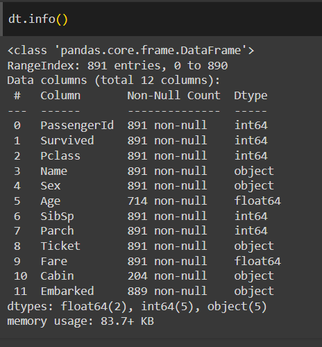

# EXNO2DS
# AIM:
     To perform Exploratory Data Analysis on the given data set.
      
# EXPLANATION:
  The primary aim with exploratory analysis is to examine the data for distribution, outliers and anomalies to direct specific testing of your hypothesis.
  
# ALGORITHM:
STEP 1: Import the required packages to perform Data Cleansing,Removing Outliers and Exploratory Data Analysis.

STEP 2: Replace the null value using any one of the method from mode,median and mean based on the dataset available.

STEP 3: Use boxplot method to analyze the outliers of the given dataset.

STEP 4: Remove the outliers using Inter Quantile Range method.

STEP 5: Use Countplot method to analyze in a graphical method for categorical data.

STEP 6: Use displot method to represent the univariate distribution of data.

STEP 7: Use cross tabulation method to quantitatively analyze the relationship between multiple variables.

STEP 8: Use heatmap method of representation to show relationships between two variables, one plotted on each axis.

## CODING AND OUTPUT
```
NAME : SUDHIR KUAMR.R
REG NO : 212223230221
```
```
import pandas as pd
import numpy as np
import matplotlib.pyplot as plt
import seaborn as sns
```

```
df.info
```

```
df.shape
```


```
df.nunique()
```

```
df["Survied"].value_counts()
```

```
per=(df["Surived].value_counts()/df.shape[0]*100).round(3)
```

```
sna.countplot(data=df,x="Survived")
```

```
df
```

```
df.Pclass.nunique()
```

```
df.rename(columns={'Sex':'Gender'},inplace=True)
```


```
sns.catplot(x='Gender',col='Survied',kind='count',data=df,height=5,aspect=.7)
```

```
sns.catplot(x='Surived',kind='count',hue='Gender',data=df)
```

```
df.boxplot(column='Age',by='Survived')
```

```
sns.jointplot(x='Age',y='Fare',data=df)
```


```
sns.catplot(data=df,x='Gender',col='Survived',hue='Pclass',kind='count')
```

```
corr=dt.corr()
sns.heatmap(corr,annot=True)
```

```
sns.pairplot(df)
fig,ax1=plt.subplots(figsize=(8,5))
pt=sns.boxplot(ax=ax1,x='Pclass',y='Age,hue='gender',data=df)
```

# RESULT:
Thus the Exploratory Data Analysis process is performed successfully on the given data using python code.
